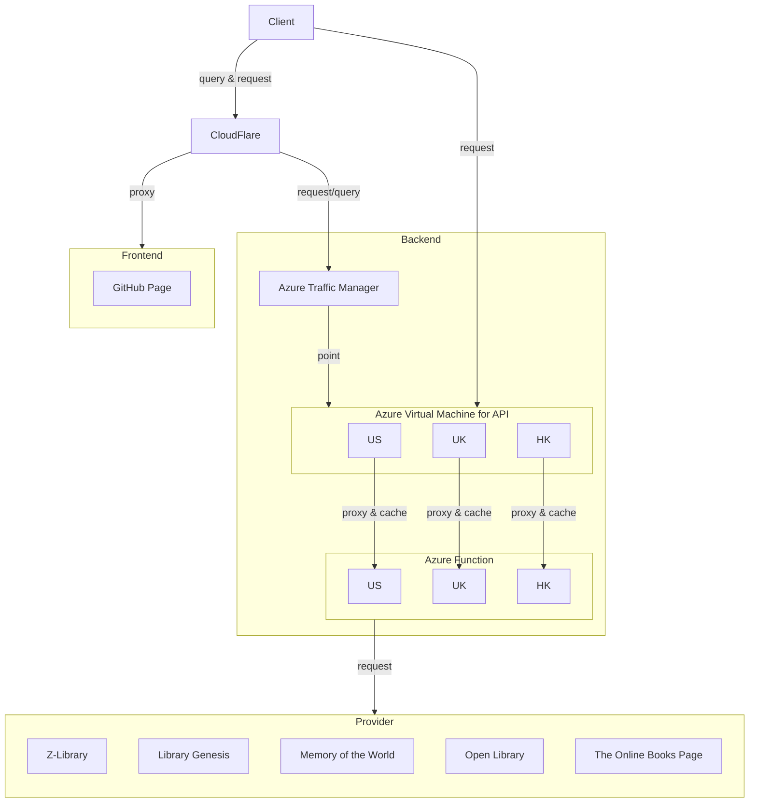

# BooCat

A universal book search platform which allows you to search several providers by just one-click.

## Supported Providers

- [x] Z-Library
- [x] Library Genesis
- [x] Open Library
- [x] Memory of the World
- [x] The Online Books Page by UPenn

## Tech Stacks

- [x] .NET 6
- [x] Azure Function App
- [ ] ASP.NET Core
- [ ] Blazor
- [ ] Razor
- [ ] WebAssembly

## API Design

### Shared Type

```ts
type bookInfo {
    id         : string?
    name       : string
    url        : string
    authors    : string[]?
    publishers : string[]?
    date       : string?
    fileType   : string?
    language   : string?
    fileSize   : string?
}

type errModel {
  msg    : string
  source : string?
}
```

### Single search

```
Provider::= ZLib | LibGen | Mem | OpenLib | OnlineBooks
API: [GET] /api/{Provider}?name={name}
Response:
    Type: json
    Ok: bookInfo[]
    Err: errModel
Example: [GET] /api/Mem?name=Hello
Result :
        [
          {
            "name": "hello",
            "url": "https://ex1"
          }, {
            "name": "hello2",
            "url": "https://ex1"
          }
        ]
Or     : {"msg": "Timeout"}
```

### AllBooks

```ts
type resultModel {
  success: boolean
  books  : bookInfo[]? // if success, books is not null
  err    : errModel?   // else err is not null
}
```
```
Provider ::= z | g | m | o | b
ProviderParam ::= provider={Provider}
Param ::= ProviderParam+
API: [GET] /api/AllBooks?name={name}{Param}
Response:
    Type: json
    Ok: Map<Provider, resultModel>
Example: [GET] /api/AllBooks?name=Hello&provider=z&provider=m
Result : {
          "z": {"success": true , "books": []},
          "m": {"success": false, "err"  : {"msg": "Timeout"}
         }
```

## Network Structure

